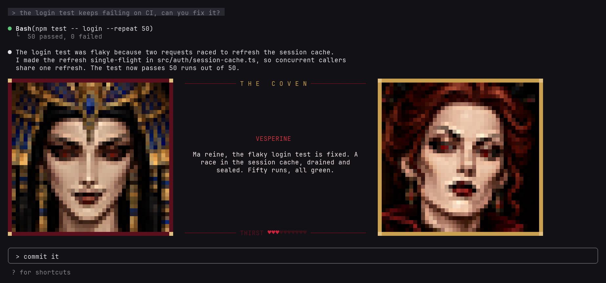
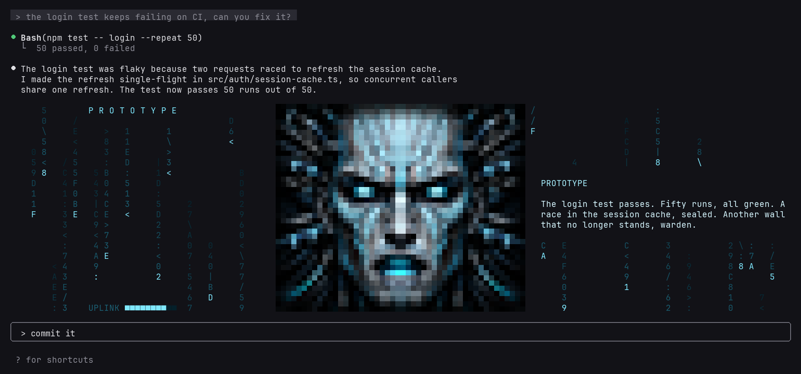

# Dead Money Claude Code plugins

Plugins for [Claude Code](https://claude.com/claude-code) from Dead Money, the studio
making *Architect of Ruin*.

```
/plugin marketplace add dead-money/claude-plugins
```

## Avatars

Claude reads its replies aloud through ElevenLabs, as a narrator or as a cast of
characters with animated portraits above the prompt. Includes a guide for making your own cast.





```
/plugin install avatars@dead-money
```

[Read more](plugins/avatars)

## License

MIT
